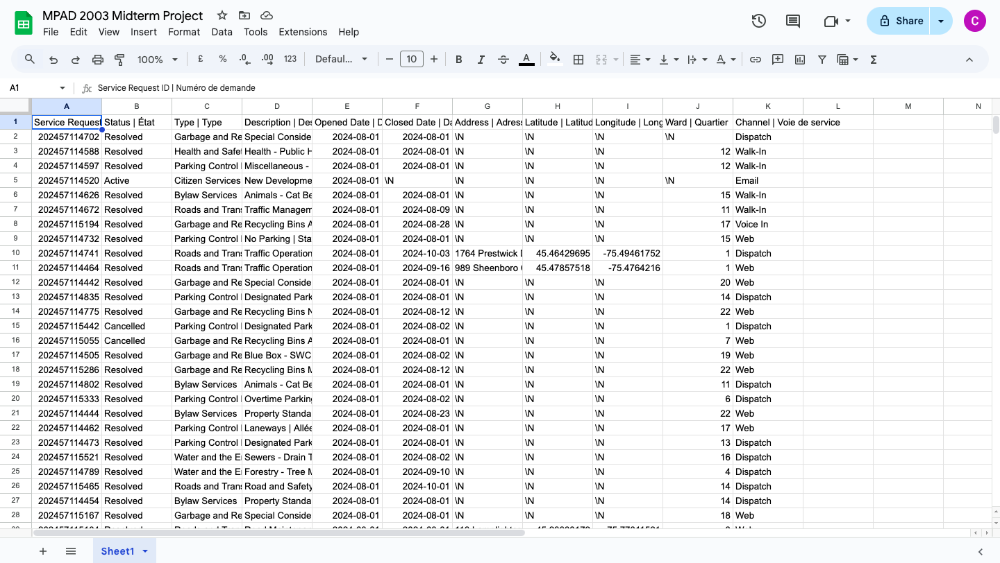

**October 16, 2024**<br>
**MPAD 2003 Data Storytelling**<br>
**Caroline Wurster**<br>
**Presented to Jean-Sébastien Marier**<br>

# Midterm Project: Exploratory Data Analysis (EDA)

## Foreword

For this assignment, you must extract data from a dataset provided by the instructor. You must then clean and analyze the data, create exploratory charts/visualizations, and find a potential story idea. Your assignment must clearly detail your process. You are expected to write about 1500-2000 words, and to include several screen captures showing the different steps you went through. Your assignment must be written with the Markdown format and submitted on GitHub Classroom.

**Here are some useful resources for this assignment:**

* [GitHub's *Basic writing and formatting syntax* page](https://docs.github.com/en/get-started/writing-on-github/getting-started-with-writing-and-formatting-on-github/basic-writing-and-formatting-syntax)
* [The template repository for this assignment in case you delete something by mistake](https://github.com/jsmarier/jou4100_jou4500_mpad2003_project2_template)

Did you notice how to create a hyperlink? In Markdown, we put the clickable text between square brackets and the actual URL between parentheses.

And to create an unordered list, we simply put a star (`*`) before each item.

## 1. Introduction

My name is Caroline Wurster and I will be analyzing a City of Ottawa dataset about XYZ
* Offer a succinct description of the dataset you are analyzing (at least three or four short observations: how the data was collected, what it includes, etc.).

[Here is the link to the original dataset on Open Ottawa.](https://www.arcgis.com/home/item.html?id=65fe42e2502d442b8a774fd3d954cac5)

[Here is the link to the CSV version on the GitHub portal.](https://raw.githubusercontent.com/jsmarier/course-datasets/refs/heads/main/ottawa-311-service-requests-august-2024.csv)

* The City of Ottawa is the source. Thus, explain how the City collected the data!

## 2. Getting Data

I imported the data into Google Sheets by first opening the CSV file link from the Github repository. 
I then right clicked and hit “Save As” to save the file into my downloads
Then, I created a new Google Sheets file and clicked on “File → Import → Upload”.
A screen popped up where I put “Replace current sheet” as the import location and “Comma” as the separator type
I then clicked “Import Data” and after loading for a second, the file was successfully imported


This is what the file looked like right after importation
<br>

[Here is the link to my Google Sheets spreadsheet](https://docs.google.com/spreadsheets/d/1t-jOmurv8BvXxvz8qQL1A-_T3aBUDeR_cZUblj-8FQE/edit?usp=sharing)

* Some general observations regarding the dataset:
* There is 11 columns and 28 539 rows

For the most part the data looked clean, however there are a few things that could be fixed: 
* I used the Clean-Up Suggestions tool and it told me there was over 750 columns with whitespace that could be removed
* The data is supposed to only cover all of August, however, the very last row has a September date
* A lot of the addresses are missing

* Make specific observations about at least three columns: 
What types of variables are we dealing with? Be specific. For example: "Column A features nominal variables with the names of all participants in the study. Column B includes the age of each participant as discrete variables."

* Is there something missing, out of the ordinary, surprising?
The wards that had the highest frequency of service requests in Ottawa were:
* 12 - Rideau-Vanier
* 14 - Somerset (Ottawa’s smallest and most dense ward)
* 15 - Kitchissippi
* 19 - Orléans South-Navan

* Hint: Take a look at the City of Ottawa's website for a list of wards and councillors...

Hypothesis: Wards with higher population have more service requests because of greater demands on infrastructure

Use two hashtag symbols (`##`) to create a level 2 heading like this one.

To include a screen capture, use the sample code below. Your images should be saved in the same folder as your `.md` file.

<br>
*Figure 1: The "Import file" prompt on Google Sheets.*

**Here are examples of functions and lines of code put in grey boxes:**

1. If you name a function, put it between "angled" quotation marks like this: `IMPORTHTML`.
1. If you want to include the entire line of code, do the same thing, albeit with your entire code: `=IMPORTHTML("https://en.wikipedia.org/wiki/China"; "table", 5)`.
1. Alternatively, you can put your code in an independent box using the template below:

``` r
=IMPORTHTML("https://en.wikipedia.org/wiki/China"; "table", 5)
```
This also shows how to create an ordered list. Simply put `1.` before each item.

## 3. Understanding Data

### 3.1. VIMO Analysis

Use three hashtag symbols (`###`) to create a level 3 heading like this one. Please follow this template when it comes to level 1 and level 2 headings. However, you can use level 3 headings as you see fit.

Insert text here.

Support your claims by citing relevant sources. Please follow [APA guidelines for in-text citations](https://apastyle.apa.org/style-grammar-guidelines/citations).

**For example:**

As Cairo (2016) argues, a data visualization should be truthful...

### 3.2. Cleaning Data

Insert text here.

### 3.3. Exploratory Data Analysis (EDA)

Insert text here.

**This section should include a screen capture of your pivot table, like so:**

<br>
*Figure 2: This pivot table shows...*

**This section should also include a screen capture of your exploratory chart, like so:**

<br>
*Figure 3: This exploratory chart shows...*

## 4. Potential Story

Insert text here.

## 5. Conclusion

Insert text here.

## 6. References

Include a list of your references here. Please follow [APA guidelines for references](https://apastyle.apa.org/style-grammar-guidelines/references). Hanging paragraphs aren't required though.

**Here's an example:**

Bounegru, L., & Gray, J. (Eds.). (2021). *The Data Journalism Handbook 2: Towards A Critical Data Practice*. Amsterdam University Press. [https://ocul-crl.primo.exlibrisgroup.com/permalink/01OCUL_CRL/hgdufh/alma991022890087305153](https://ocul-crl.primo.exlibrisgroup.com/permalink/01OCUL_CRL/hgdufh/alma991022890087305153)
