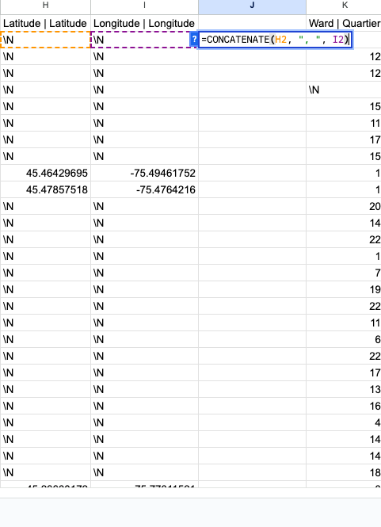
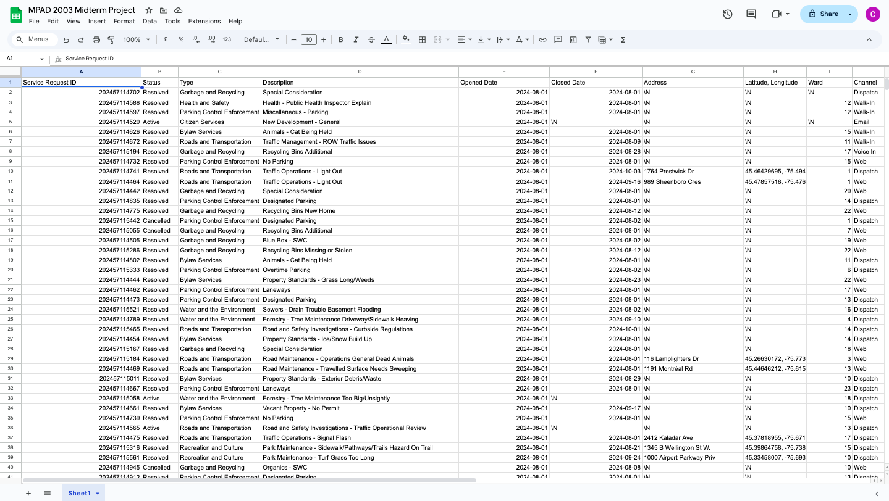

**October 16, 2024** 
**MPAD 2003 Data Storytelling** 
**Caroline Wurster** 
**Presented to Jean-Sébastien Marier** 

# Midterm Project: Exploratory Data Analysis (EDA)

**Here are some useful resources for this assignment:**

* [The template repository for this assignment in case you delete something by mistake](https://github.com/jsmarier/jou4100_jou4500_mpad2003_project2_template)

## 1. Introduction

My name is Caroline Wurster and I will be analyzing a City of Ottawa dataset about the service requests made in all of August 2024.

To begin, I made a few short observations about about the dataset we'll be looking at:

__How The Data Was Collected:__

The City of Ottawa collected the service request data from a variety of channels, including: 311 Contact Centre, Client Service Centres, 311 Email, and Web-based Self-Service portal. The data is then presented on the Open Ottawa website where it is updated monthly. 

__Time Period Of The Data:__

For this dataset, we will be looking at service requests from August 1, 2024 to August 31, 2024.

__Variable Types__

With 11 columns total, the dataset contains both categorical variables (e.g., status, type) and numeric variables (e.g., latitude, longitude), which will require different handling in the analysis.

[Link to the original dataset on Open Ottawa.](https://www.arcgis.com/home/item.html?id=65fe42e2502d442b8a774fd3d954cac5)

[Link to the CSV version on the GitHub portal. This is the dataset we'll be looking at.](https://raw.githubusercontent.com/jsmarier/course-datasets/refs/heads/main/ottawa-311-service-requests-august-2024.csv)

## 2. Getting Data

I imported the data into Google Sheets by first opening the CSV file link from the Github repository. 
I then right clicked and hit “Save As” to save the file into my downloads
Then, I created a new Google Sheets file and clicked on “File → Import → Upload”.
A screen popped up where I put “Replace current sheet” as the import location and “Comma” as the separator type.
I then clicked “Import Data” and after loading for a second, the file was successfully imported.

 
*Figure 1: The file right after importing it into Google Sheets.*
[Link to my Google Sheets spreadsheet](https://docs.google.com/spreadsheets/d/1t-jOmurv8BvXxvz8qQL1A-_T3aBUDeR_cZUblj-8FQE/edit?usp=sharing)

__General Observations Regarding The Dataset:__
* There is 11 columns and 28 539 rows
* As for the cleanliness of the data, there are a few things that could be fixed: 
* Using the Clean-Up Suggestions tool, it told me there was over 750 columns with whitespace that could be removed.
* Upon further investigation, I also found that the data is supposed to only cover all of August, however, the very last row has a September date
* I also found that many of addresses are missing. In the future, we may need to fill in the missing values or exclude these entries, depending on our analysis goals.

__Specific Observations About Three Columns:__ 

__Column A__

Column A contains the service request ID of each request made, represented as discrete variables. Each ID provides a unique numeric identifier that allows for easy tracking and reference within the dataset. This identifier ensures that each request can be precisely located in the records without the need to reference other details, such as location, which helps maintain confidentiality. By using unique IDs, it is possible to manage, update, and analyze individual requests efficiently, even if other details of the request (like location) are withheld for privacy.

__Column B__

Column B contains the status of each service request as a nominal variable. The status describes each request as either resolved, active, or cancelled. If the request is resolved, it means the problem was fixed. If the request is active, it is still being worked on. If the request is cancelled, it means the service is no longer needed.

__Column H / I__

Columns H and I contain the latitude and longitude of each service request as continuous variables. However, many rows have ‘/N’ instead of a location, likely because certain service requests could be linked to specific households. Revealing the exact location might compromise privacy. Instead, the dataset includes the ward for each service request. This way, the precise address is not disclosed, but the general area (ward) is still provided.

__Is There Something Missing, Out Of The Ordinary, Or Surprising About The Data?__
* One notable finding in the dataset is recorded in row 10, which details a traffic light outage that took an unusually long time to resolve—specifically, from August 1st to October 3rd, a span of over two months. This is particularly surprising because traffic light outages are critical issues that typically require immediate attention for the safety and convenience of everyone on the road.

__Hypothesis:__ Wards with higher population (such as Rideau-Vanier, Somerset, Kitchissippi, Orléans South-Navan) take longer to resolve service requests because of the amount of service requests they receive.

## 3. Understanding Data

### 3.1. VIMO Analysis

For my VIMO analysis, I used the “Review Column Stats” tool under Data → Data Cleanup → Cleanup Suggestions to help me visualize each column using a bar graph.

 
*Figure 2: The Review Column Stats tool, illustrating the most frequently used channels for submitting service requests.*

__Valid:__ The status column serves as a good example of a valid value set, containing only the defined categories: 'Active,' 'Resolved,' and 'Cancelled.' Each entry is accounted for, with no blank or missing values present and they all fall within the expected range.

__Invalid:__ In the final row of data, there is a September opening date, which is technically considered invalid since this dataset is intended to reflect only service requests made throughout August.

__Missing:__ The addresses, longitude, and latitude columns contain numerous entries marked as '/N,' indicating that the expected data is absent or missing.

__Outliers:__ In the channel column, the outlier is 'counter' (as illustrated in Figure 2), with only 2 people submitting service requests in this manner. However, this may also be classified as walk-in service. We will address this inconsistency during the data cleaning process.

Support your claims by citing relevant sources. Please follow [APA guidelines for in-text citations](https://apastyle.apa.org/style-grammar-guidelines/citations).

**For example:**

As Cairo (2016) argues, a data visualization should be truthful...

### 3.2. Cleaning Data (441 words)

To clean the data, I used a few different methods including: 

__1. The Google Sheets Data-Cleaning Tools__

 
*Figure 3: Data Cleanup Tools such as "Cleanup Suggestions", "Remove Duplicates", and "Trim Whitespace"*

* To trim the whitespace in the dataset, I simply clicked "Trim Whitespace" in the Data Cleanup Tools, and then it just automatically did it for me
* To remove duplicates, I clicked the "Remove Duplicates" button, however it told me that no duplicate rows were found
* As I mentioned earlier, I used the find and replace tool (Control + F) to find the word "Counter" and replace it with "Walk-In"

 
*Figure 4: Using the find and replace tool*

__2. Used The Split Function__

The SPLIT function divides text around a specified character or string, and puts each fragment into a separate cell in the row.

To clean the data, I used the SPLIT function for the “Description” column because it had an English and French description. However, for this dataset, everything is only in English so we didn’t need the French translation.

* To start, I added 2 new columns 
* In one of the columns, I wrote the SPLIT function as so:
`=SPLIT(D2, "|")`
* I used "|" as the delimiter because this is where the English and French are separated so they'll go into different columns

 
*Figure 5: Use the SPLIT function to separate the values into 2 separate columns*

* I then double-clicked the small blue square in the lower-right corner of the cell with the formula so it would do it to the rest of the cells
* Right click to “Paste Special” → “Values Only” so you can edit the cells 
* Delete the French column (column F) and delete the original column (column D)
* Change the heading to "Description"

__3. Used The Concatenate Function__

The CONCATENATE function appends strings to one another.

To further clean the data, I used the CONCATENATE function to put the latitude and longitude into one collective column.

* To start, I added a new column
* In the column, I wrote the CONCATENATE function as so:
`=CONCATENATE(H2, ", ", I2)`
* I wrote it this way so that between the latitude and longitude, there would be a comma with a space beside it to easily differentiate between the two

 
*Figure 6: Use the CONCATENATE function to join 2 separate values into 1 column.*

* I then double-clicked the small blue square in the lower-right corner of the cell with the formula so it would do it to the rest of the cells
* Since there was a lot of \N, \N's, I used the find and replace tool to replace them with just a single \N
* Right click to “Paste Special” → “Values Only” so you can edit the cells 
* Delete the original columns, H and I
* Change the heading to "Latitude, Longitude"

__After The Cleaning Process__

After these methods, I manually went in and changed all of the titles so they were just English, expanded the columns so you could see all of the data, and deleted the last column that had a September date.

 
*Figure 7: Final dataset after the cleaning process.*

### 3.3. Exploratory Data Analysis (EDA)

Now that the data is clean, I made a pivot table and bar chart to conduct an exploratory data analysis. 

The variables I chose to examine were "Type" and "Status". I chose these variables because I wanted to see what services are most in demand and how effectively the city is addressing those demands. 

* The "Type" variable categorizes service requests. This helps in understanding which services residents use the most, and which issues or services require the city’s attention.
* The "Status" variable (Active, Resolved, Cancelled) shows the progress of each request. This variable is essential for evaluating the effectiveness and efficiency of the city’s response to service requests.

 
*Figure 8: This pivot table shows the volume and resolution status of service requests by type.*

 
*Figure 9: This exploratory bar chart shows...*

After examining the pivot table and chart, there were a couple statistics that stood out to me:

* One specific statistic that stood out to me is "Garbage and Recycling". I noticed that this category has the highest total requests (10,257), with the majority resolved (10,033). 
* Another statistic that stood out to me was the amount of active requests regarding Water and the Environment. There are 1,089 active requests out of a total of 3,313. This is a large proportion of unresolved cases.

From this data and these observations, there were a few things I learned:

* Some service types, like Garbage and Recycling, have an exceptionally high volume of requests, most of which are resolved. This could imply either strong efficiency in resolving these requests or that they are straightforward to address.
* Other high-demand categories, such as Bylaw Services and Roads and Transportation, also show large volumes of requests, but with a significant number still active, indicating possible delays or backlogs.
* Water and the Environment and Roads and Transportation have a high number of unresolved, active requests. This suggests that these services might need additional resources or more efficient workflows to meet demand.

A potential story that we could create from this could be:
* __“Top Issues Residents Report and How Well They’re Addressed”__
* This could be a general story that explores the most common types of service requests and the city’s responsiveness in each area. 

Some variables and numbers that could warrant further investigation include:
* Understanding the time taken to resolve different types of requests. This would reveal efficiency in service delivery and help us understand where delays occur.
* To warrant further investigation, I could calculate the average time for each type of request to be resolved. I could then compare this across different types and statuses to see which requests take the longest to resolve. Longer resolution times for certain categories might indicate a need for additional resources or process improvements.

## 4. Potential Story

In order to further dig into the story: __“Top Issues Residents Report and How Well They’re Addressed”__, there's a few things I'd need to do.

__What else would you need to "tell" this story?__

__Who could you interview about it?__
* I could interview or survey residents in specific wards to get their perspectives on service satisfaction

__Do some research and list relevant sources you came across that could help you provide more context__

## 5. Conclusion

Throughout this assignment, I went through some challenging and rewarding aspects.

One example of a challenging aspect for me was the VIMO Analysis. I think I struggled with this part of the assignment because it was difficult to find missing or invalid data in such a large dataset, compared to the smaller datasets that we've looked at in the past.

The most rewarding aspect of this assignment for me was cleaning the data. I think this was the most rewarding because I feel as though I have a pretty good understanding of the different functions and tools on Google Sheets that we learned in the modules and in class. I found it interesting to use what I've learned and being able to apply it to this assignment.

## 6. References

Include a list of your references here. Please follow [APA guidelines for references](https://apastyle.apa.org/style-grammar-guidelines/references). Hanging paragraphs aren't required though.

**Here's an example:**

Bounegru, L., & Gray, J. (Eds.). (2021). *The Data Journalism Handbook 2: Towards A Critical Data Practice*. Amsterdam University Press. [https://ocul-crl.primo.exlibrisgroup.com/permalink/01OCUL_CRL/hgdufh/alma991022890087305153](https://ocul-crl.primo.exlibrisgroup.com/permalink/01OCUL_CRL/hgdufh/alma991022890087305153)
